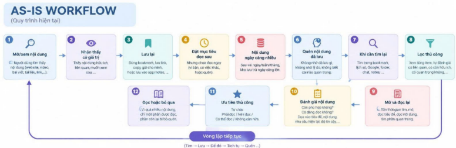
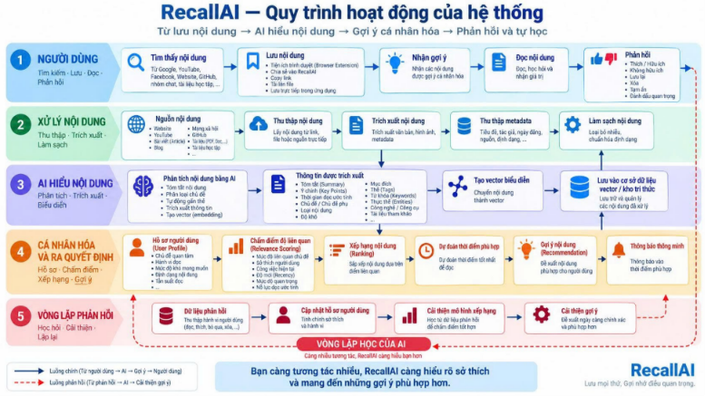

# 02 — Group Problem Statement (Bản nộp nhóm)


> Làm chung 1 bản, mỗi thành viên copy vào repo cá nhân. Đi theo Phase 3 → 6 trong `01-worksheet.md`. Nhóm chỉ chọn **candidate problem** ở Phase 3, viết Problem Statement sau khi validate + vẽ workflow.


## Thành viên nhóm


| STT | Họ và tên | Mã học viên | Vai trò trong nhóm (VD: facilitator, workflow, research, writer) |
|-----|-----------|-------------|---------------------------------------------------------------|
| STT | Họ và tên           | Mã học viên | Vai trò trong nhóm |
|-----|---------------------|-------------|---------------------|
| 1   | Ngô Anh Tú          | 2A202602396       | Leader/Facilitator  |
| 2   | Nguyễn Hải Nam      | 2A202602476       | Researcher          |
| 3   | Trần Thị Thu Hiền   | 2A202602737       | Workflow            |
| 4   | Bùi Phương Duy      | 2A202602684       | Workflow            |
| 5   | Lê Trung Kiên       | 2A202602748       | Researcher          |
| 6   | Nguyễn Trần Bảo Tâm | 2A202602408       | Writer              |
                                                  
  
**Candidate problem nhóm chọn (1 câu): Người dùng lưu quá nhiều nội dung để đọc sau nhưng khó xác định nội dung nào đáng ưu tiên, dẫn đến nhiều nội dung có giá trị bị bỏ quên và không được đọc lại.


---


## Phase 3 — Group Convergence: từ 9-12 candidates về 1


### 3.1. Trình bày top 3 mỗi người (mỗi candidate 1-2 phút)


| # | Người đưa ra | Candidate problem | Người gặp vấn đề | Điểm nghẽn | Cảm nhận nhanh của nhóm |
|---|---|---|---|---|---|
| 1 | Nguyễn Hải Nam | Phải liên tục kiểm tra email, group chat, Outlook để không lỡ deadline/lịch học/thông báo | Học viên VinAI thực chiến | Học viên phải liên tục tự đọc, lọc và xem thông tin từ nhiều nguồn khác nhau để không bị bỏ lỡ chương trình | Pain rõ, xảy ra hằng ngày, AI fit tốt |
| 2 | Nguyễn Hải Nam | Người dùng khó tìm lại tài liệu, link và ghi chú do lưu rải rác trên nhiều nền tảng | Người dùng thường xuyên lưu và tra cứu tài liệu số | Phải tự nhớ tài liệu nằm ở đâu và tìm kiếm thủ công trên nhiều nguồn | Pain phổ biến, nhưng scope dễ bị rộng |
| 3 | Nguyễn Hải Nam | Team phải tổng hợp tiến độ từ GitHub, chat, docs và task board trước mỗi buổi meeting | Team project | Phải tổng hợp và đối chiếu tiến độ thủ công từ nhiều nguồn | AI fit rất tốt, workflow rõ, metric dễ đo |
| 4 | Bùi Phương Duy | Viết báo cáo thực tập hàng tuần: phải nhớ lại và tổng hợp việc đã làm từ nhiều nguồn rời rạc | Thực tập sinh + người hướng dẫn | Phải tổng hợp task, commit, ghi chú rồi viết lại thành báo cáo mạch lạc | Workflow rõ, lặp lại đều, dễ đo 90' → <30' |
| 5 | Bùi Phương Duy | Không có mặt ở nhà khi shipper giao hàng, phải nhắn tin/gọi qua lại nhiều lần để đổi giờ hoặc gửi hàng xóm | Bản thân + shipper + hàng xóm | Thương lượng đổi giờ hoặc phương án giao hàng thủ công | Pain thật nhưng AI fit thấp, có thể process fix |
| 6 | Bùi Phương Duy | Tổng hợp ghi chú ôn thi từ slide giảng viên + trao đổi nhóm rải rác nhiều nguồn trước kỳ thi | Bản thân + nhóm học | Lọc thông tin quan trọng từ chat nhóm dài và nhiều tài liệu | Pain mạnh, AI có thể hỗ trợ tóm tắt và tổng hợp |
| 7 | Nguyễn Trần Bảo Tâm | Tốn thời gian khi đọc tài liệu để làm bài tập/lab | Sinh viên | Tìm nguồn, đọc, lọc và tổng hợp thông tin trước khi làm bài | Workflow lặp lại, impact đo được, cần scope AI rõ |
| 8 | Nguyễn Trần Bảo Tâm | Sinh viên phải tra nhiều nhóm chat để tìm thông báo quan trọng | Sinh viên | Thông tin quan trọng bị chìm giữa nhiều message và nhiều nhóm chat | Pain rõ nhưng khá trùng với #1, nên cân nhắc merge |
| 9 | Nguyễn Trần Bảo Tâm | Người mua khó quyết định sản phẩm phù hợp khi đọc quá nhiều review | Người mua online | Phải đọc và tổng hợp lượng lớn review trước khi quyết định | Pain rõ, AI fit tốt, nhưng hơi lệch khỏi context IT/education |
| 10 | Ngô Anh Tú | Sau meeting, người tham gia phải tự tổng hợp summary, decisions và action items | PM / BA / Meeting owner | Phải lọc discussion, decision và action item rồi viết lại thành meeting minutes | AI fit rất rõ, workflow đẹp, dễ demo |
| 11 | Ngô Anh Tú | QA phải đọc requirements và thủ công chuyển chúng thành test cases | QA / Tester | Phân tích business logic, xác định scenarios và viết test cases thủ công | AI fit mạnh, đo được thời gian và test coverage |
| 12 | Ngô Anh Tú | Khi requirement thay đổi, team phải tìm và cập nhật các phần documentation bị ảnh hưởng | BA / PM / Dev / QA | Khó xác định requirement change ảnh hưởng đến documents/sections nào | Impact lớn, rất BA-core nhưng complexity cao hơn |
| 13 | Lê Trung Kiên | Đọc transcript cuộc họp với khách hàng/nhóm để lọc Yêu cầu (Requirements) & Action Items đưa lên Trello/Jira | - Workflow rõ ràng 5 bước, điểm nghẽn nằm ở khâu đọc ghi âm và gõ tay<br>- Tần suất họp cao (3 lần/tuần), tiết kiệm ngay 60 phút/buổi họp<br>- Đầu ra dạng Ticket/Action Items đo lường được trực quan | Độ chính xác của AI khi nhận diện ngữ cảnh tiếng Việt và các thuật ngữ chuyên ngành (domain jargon) trong cuộc họp |
| 14 |Lê Trung Kiên | Tìm kiếm, tóm tắt tài liệu nghiên cứu và trích dẫn chuẩn APA cho bài luận/báo cáo đồ án nhóm | - Giải quyết pain point lớn của sinh viên/researcher (tốn 120 phút cho bài 15 trang)<br>- Các bước tìm kiếm - đọc lướt - tóm tắt - tạo APA rất rõ ràng<br>- AI phát huy thế mạnh vượt trội ở khâu xử lý và tóm tắt văn bản dài | AI có thể bị ảo giác (hallucination) tạo trích dẫn giả hoặc tóm tắt sai ý chính của bài báo khoa học |
| 15 |Lê Trung Kiên | Lọc comment & phân tích cảm xúc (Sentiment) để trích xuất danh sách câu hỏi thắc mắc thường gặp (FAQ) bài đăng tuyển dụng | - Tiết kiệm 75 phút đọc 200+ comment cho mỗi chiến dịch tuyển dụng/marketing<br>- Giúp phát hiện sớm các thắc mắc gấp để phản hồi ứng viên kịp thời<br>- Dễ áp dụng prompt AI để gom nhóm câu hỏi tự động | Ngôn ngữ comment nhiều teencode, viết tắt, câu thiếu ngữ cảnh khiến AI phân loại nhầm sentiment |
| 16 | Trần Thị Thu Hiền | Người dùng lưu nhiều nội dung để đọc sau, nhưng khi số lượng tăng lên thì khó tìm lại, khó ưu tiên và thường quên quay lại đọc. | Sinh viên, researcher, knowledge worker | Sau khi lưu, người dùng phải tự tìm lại, đánh giá và quyết định nội dung nào đáng đọc trước. | Pain rõ, xảy ra thường xuyên, có thể đo được và phù hợp để AI hỗ trợ. |
| 17 | Trần Thị Thu Hiền | Khi nghiên cứu một chủ đề, người dùng phải mở và đọc nhiều nguồn mới xác định được tài liệu nào thực sự hữu ích. | Sinh viên, researcher | Phải tự đọc, đánh giá và so sánh nhiều nguồn trước khi chọn được tài liệu phù hợp. | Tốn nhiều thời gian, AI có tiềm năng hỗ trợ summary và ranking. |
| 18 | Trần Thị Thu Hiền | Khi mua hàng online, người dùng phải xem nhiều sản phẩm và nguồn review nhưng vẫn khó xác định sản phẩm phù hợp với nhu cầu và ngân sách. | Người mua hàng online | Phải tự tổng hợp review, so sánh nhiều lựa chọn và cân đối với nhu cầu/ngân sách. | Pain thực tế và dễ hiểu, nhưng phạm vi khá rộng và cần dữ liệu sản phẩm đáng tin cậy. |


### 3.2. Gom trùng / cluster (gom 9-12 ý thành 3-4 cụm)


### 3.2. Gom trùng / cluster


| Cluster | Candidates included | Pattern chung | Ghi chú |
|---|---|---|---|
| A | #1, #8 | Thông tin quan trọng bị phân tán trên nhiều kênh, người dùng phải tự tìm và lọc để không bỏ sót | Hai candidate gần như cùng một problem, có thể merge thành bài toán information overload |
| B | #2, #6, #7, #14, #16, #17 | Người dùng lưu/tìm kiếm/đọc nhiều tài liệu nhưng khó tìm lại, khó lọc và khó xác định nội dung nào thực sự hữu ích | **Cluster phù hợp nhất với #16**; pain phổ biến, workflow rõ và có nhiều điểm AI có thể hỗ trợ |
| C | #3, #4, #10, #11, #12, #13 | Phải tổng hợp và chuyển đổi thông tin từ nhiều nguồn thành output có cấu trúc cho project/work | AI fit rất mạnh, đặc biệt với meeting, requirement, test case và progress tracking |
| D | #5, #9, #15, #18 | Người dùng phải xử lý nhiều thông tin/tương tác trước khi đưa ra quyết định hoặc hành động | Có pain rõ nhưng một số candidate lệch context IT/education hoặc AI fit chưa mạnh |


### 3.3. Shortlist (giữ 2-3 bài trả lời được 7 câu hỏi worksheet)


### 3.3. Shortlist (giữ 2-3 bài trả lời được 7 câu hỏi worksheet)


| Candidate | Vì sao vào shortlist (2-3 ý) | Rủi ro / điều chưa rõ |
|---|---|---|
| #10 - Sau meeting phải tự tổng hợp summary, decisions và action items | Workflow rõ ràng; pain xảy ra thường xuyên với PM/BA; AI fit cao và output dễ đo lường | Cần xác định nguồn input là transcript/audio hay meeting notes; cần đảm bảo AI không bỏ sót hoặc hiểu sai decisions/action items |
| #16 - Người dùng khó tìm lại, ưu tiên và quay lại đọc nội dung đã lưu | Pain phổ biến; workflow rõ từ Save → Accumulate → Search/Review → Prioritize → Read; AI có thể hỗ trợ phân loại, tóm tắt và ranking | Scope dễ bị rộng; chưa rõ nội dung được lưu ở nền tảng nào và tiêu chí nào dùng để ưu tiên |
| #1 - Phải liên tục kiểm tra email, group chat, Outlook để không lỡ deadline/lịch học/thông báo | Pain xảy ra hằng ngày; information bị phân tán nhiều nguồn; AI có thể hỗ trợ gom, lọc và ưu tiên thông báo | Cần xác định nguồn dữ liệu và quyền truy cập; dễ trùng với bài toán notification/automation thuần túy nếu scope AI không rõ |


### 3.4. Score để đồng thuận (chấm 1-5, ép nói rõ vì sao cho 5 / cho 3)


| Candidate | Actor rõ | Workflow rõ | Pain có evidence | Impact đo được | Làm trong lab | So sánh R/W/A được | Nhóm hiểu domain | Tổng |
|---|---:|---:|---:|---:|---:|---:|---:|---:|
| #10 - Meeting → Summary / Decisions / Action Items | 5 | 4 | 4 | 5 | 5 | 5 | 5 | **33/35** |
| #16 - Saved content → Find / Prioritize / Read | 5 | 4 | 5 | 5 | 5 | 5 | 5 | **34/35** |
| #1 - Multi-channel notifications → Filter / Prioritize | 5 | 5 | 4 | 4 | 4 | 4 | 5 | **31/35** |


**Candidate nhóm chọn (1 bài duy nhất):**


```Người dùng thường lưu nhiều bài viết, video, tài liệu hoặc link để đọc sau, nhưng khi số lượng ngày càng nhiều, họ khó xác định nội dung nào đáng ưu tiên và thường quên quay lại đọc.
```


**Vì sao chọn (4-5 câu):**


```Người dùng lưu quá nhiều nội dung để đọc sau nhưng khó xác định nội dung nào đáng ưu tiên, dẫn đến nhiều nội dung có giá trị bị bỏ quên và không được đọc lại.


```


**Vì sao KHÔNG chọn các candidate còn lại (mỗi bài 2-3 câu):**


```Về candidate meeting notes, team lo ngại về tính khả thi của prob khi sẽ cần dùng nhiều model AI phức tạp, tích hợp cả transcriptor,... CŨng như lo ngại về vấn đề unique prob khi trên thị trường đã có những sản phẩm làm khá tố như Notion AI. Về candidate lọc/ phân tích thông báo và ưu tiên, team lo ngại về vấn đề truy xuất dư liệu từ các nền tảng giao tiếp cá nhân như Zalo, Messenger,... CŨng như vấn đề về unique như candidate trên
```


**Disagreement (nếu có — ai lo gì, chốt ra sao):**


```Lo ngại về việc không có Bottleneck rõ ràng để xử lí cũng như yêu cầu về painpoint có đủ mạnh để tìm được người interview/ gather data qua survey. Tuy nhiên sau khi thảo luận và test survey thì team chốt prob do có đa số interviewer có vấn đề tương tự


```


---


## Phase 4 — Quick Validation + Research


### 4.1. Quick validation (ít nhất 1 cách: interview 2-3 người hoặc survey 5-10 người)


| Nguồn | Số người / mẫu | Tín hiệu xác nhận (kèm quote nguyên văn) | Tín hiệu phản bác | Nhóm sửa problem thế nào |
|---|---:|---|---|---|
| Interview | 8 (phỏng vấn nhanh bạn cùng lớp/khóa VinAI + vài người ngoài lớp, chi tiết ở file notes) | 6/8 xác nhận có thói quen lưu bài đọc sau nhưng ít quay lại. Quote: (#1); Quote: (#2) | 2/8 người (#4, #7) nói họ lưu ít hoặc nội dung có deadline bắt buộc nên không thấy đây là vấn đề | Thu hẹp actor về nhóm **lưu nhiều nội dung không bắt buộc** (blog, tips, bài mạng xã hội...) và nhấn pain ở bước **ưu tiên/xác định cái nào đáng đọc trước**, không phải ở việc lưu hay tìm lại |


**Insight sau validation (1-2 câu — pain thật nằm ở đâu):**


```text
Pain thật không nằm ở việc lưu vì lưu dễ vì ai cũng làm được mà nằm ở bước sau đó: không có tín hiệu nào giúp người dùng biết nội dung nào đáng đọc trước, nên nội dung có giá trị bị chìm trong danh sách và dần bị bỏ quên — đặc biệt rõ ràng sẽ là ở các nhóm lưu nhiều, còn nhóm lưu ít thì có thể sẽ chưa cần thiết.
```


Bằng chứng đính kèm (nếu có): `02-group-problem-statement-interview-notes.md`


### 4.2. Research giải pháp đã có (ít nhất 2-3 tools/patterns + 1-2 link kiểm được)
| Nguồn / tool / case | Link | Họ giải quyết bước nào? | Điểm mạnh | Khoảng trống / rủi ro | Bài học cho nhóm |
|---|---|---|---|---|---|
| **Readwise Reader** | https://docs.readwise.io/reader/guides/workflows/recommendations | **Save → Organize → Read → Recommend/Rediscover.** Hỗ trợ lưu article, PDF, newsletter, video; có Later/Shortlist và có thể dùng AI dựa trên lịch sử đọc/highlight để gợi ý nội dung nên đọc tiếp. | Rất gần bài toán RecallAI; quản lý reading backlog tốt, hỗ trợ recommendation, search và rediscovery. | Recommendation vẫn thường cần người dùng chủ động dùng Shortlist, workflow hoặc prompt. Chưa tập trung rõ vào một **dynamic priority score liên tục cho toàn bộ unread backlog dựa trên active goal + urgency + context**. | RecallAI không nên khác biệt chỉ bằng “AI recommend”. Core nên là **automatic prioritization + Why now? + priority thay đổi theo mục tiêu hiện tại**. |
| **mymind** | https://mymind.com/how-does-it-work | **Save → Understand → Auto-organize → Search/Rediscover.** AI tự tag, phân loại, tạo summary và hỗ trợ đưa nội dung cũ trở lại qua Serendipity. | Giảm công sức tổ chức thủ công; trải nghiệm “save trước, AI tự sắp xếp sau” rất tốt; giải quyết một phần vấn đề “lưu rồi quên”. | Resurfacing thiên về rediscovery hơn là quyết định **nội dung nào đáng đọc nhất ngay lúc này** dựa trên mục tiêu, deadline và context của user. | RecallAI nên học cách tự động hóa tag/phân loại, nhưng phần resurfacing cần có lý do rõ ràng: **tại sao nội dung này relevant với tôi lúc này?** |
| **Raindrop.io** | https://raindrop.io/pro | **Save → Organize → Search → Rediscover.** Hỗ trợ bookmark management, full-text search, AI Suggestions cho tag/collection và AI Assistant để tìm lại nội dung đã lưu. | Quản lý bookmark mạnh, search tốt, giảm thời gian tổ chức và tìm lại nội dung. | Trọng tâm vẫn là **organization + retrieval**. Người dùng vẫn phải chủ động tìm hoặc duyệt thư viện; chưa tập trung vào việc biến backlog thành một hàng đợi ưu tiên động. | RecallAI không nên build thêm một bookmark manager đầy đủ. Giá trị nên nằm ở **decision layer**: hiểu nội dung → match với goal → score → rank → resurface → học từ feedback. |


**Research takeaway (2-3 câu — nên build gì / không build gì):**


```text
Các tool hiện tại đã làm tốt việc lưu, tổ chức và tìm lại nội dung, nên RecallAI không cần cạnh tranh ở các tính năng này.


MVP nên tập trung vào điểm khác biệt chính: tự động ưu tiên nội dung theo mục tiêu và ngữ cảnh hiện tại, sau đó gợi lại đúng lúc và giải thích “Why now?”.


Core flow: SAVE → UNDERSTAND → GOAL MATCH → PRIORITIZE → RESURFACE → READ → LEARN.


```
> Lưu ý: không dùng số liệu AI đưa nếu không verify được link chính thức. Ghi rõ giả định chưa chắc.


---


## Phase 5 — Workflow + Problem Statement


### 5.1. Current workflow bản nhóm




```text
[1 Tìm thấy nội dung: 1-5' - người]
→ [2 Lưu nội dung: ~1' - người]
→ [3 Để đó đọc sau: nhiều ngày/tuần - người]
→ [4 Nội dung tích tụ: liên tục - bottleneck]
→ [5 Muốn tìm lại: 5-10' - người]
→ [6 Tìm và đánh giá thủ công: 10-20' - người]
→ [7 Quyết định đọc/bỏ qua: 1-2' - người]
```


| Bước | Actor | Input | Output | Thời gian / tần suất | Ghi chú (handoff? bottleneck?) |
|---|---|---|---|---|---|
| 1 | Người dùng | Bài viết, video, PDF, link, tài liệu học tập | Nội dung thấy hữu ích | 1-5 phút/lần | — |
| 2 | Người dùng | Nội dung vừa tìm thấy | Bookmark, link, note hoặc tab | ~1 phút/lần | Nội dung có thể được lưu ở nhiều nơi |
| 3 | Người dùng | Nội dung đã lưu | Danh sách nội dung chờ đọc | Hàng ngày/tuần | Dễ bị quên hoặc trì hoãn |
| 4 | Người dùng | Nhiều nội dung đã lưu | Kho nội dung ngày càng lớn | Liên tục | **Bottleneck: nội dung tích tụ, không được tự động sắp xếp và ưu tiên** |
| 5 | Người dùng | Nhu cầu tìm lại nội dung | Một số nội dung có khả năng liên quan | 5-10 phút/lần | Phải nhớ nội dung được lưu ở đâu |
| 6 | Người dùng | Các nội dung tìm được | Nội dung được đánh giá là hữu ích/không hữu ích | 10-20 phút/lần | **Bottleneck: phải tự tìm, đọc và đánh giá từng nội dung** |
| 7 | Người dùng | Nội dung đã đánh giá | Chọn đọc, bỏ qua hoặc để lại sau | Mỗi lần quay lại kho | Không có cơ chế tự động ưu tiên theo nhu cầu hiện tại |


**Bottleneck chính (2-3 câu):**


```text
Bottleneck chính nằm sau bước lưu nội dung, khi người dùng phải tự tìm lại,
tự đọc và tự đánh giá nội dung nào thực sự quan trọng. Khi số lượng nội dung
tăng lên, người dùng mất nhiều thời gian để lọc và ưu tiên, đồng thời dễ quên
hoặc bỏ qua những nội dung có giá trị.


### 5.2. Future workflow bản nhóm


Phải nhìn ra 5 thứ: bước nào máy (Rule), bước nào AI, bước nào người, boundary ở đâu, fallback khi AI sai.



[👉 Bấm vào đây để mở xem ảnh gốc image-1.png](image-1.png)


```text
[1 Tìm thấy nội dung: 1-5' - người]
→ [2 Lưu vào RecallAI: ~30s - người]
→ [3 Kiểm tra URL + trùng lặp: <1s - máy/Rule]
→ [4 Trích xuất + làm sạch nội dung: vài giây - máy]
→ [5 Tóm tắt + phân loại + gắn tag: vài giây - AI]
→ [6 Xếp hạng mức độ phù hợp + đề xuất: vài giây - AI]
→ [7 Review recommendation: 1-2' - người/boundary]
→ [Đọc / bỏ qua / lưu lại: người]
→ [Feedback → cập nhật User Profile → cải thiện recommendation]


Fallback:
Nếu AI tóm tắt, phân loại hoặc đề xuất sai, người dùng có thể chỉnh tag,
đánh dấu "Không hữu ích", bỏ qua recommendation hoặc tự chọn nội dung.
Feedback của người dùng được sử dụng để cập nhật User Profile và cải thiện
các recommendation tiếp theo.
```


**Before/after impact:**


| Metric | Trước | Sau kỳ vọng | Cách đo |
|---|---:|---:|---|
| Tổng thời gian | 20-35 phút/lần | 5-10 phút/lần | Đo thời gian từ lúc tìm nội dung đã lưu đến khi chọn được nội dung cần đọc |
| Số bước | 7 bước | 5-6 bước chính | Đếm số bước trong workflow trước và sau |
| Số bước thủ công | 7/7 | 2-3/6 | Đếm số bước người dùng phải trực tiếp thực hiện |
| Bottleneck chính | Tự tìm lại + tự đọc + tự đánh giá + tự ưu tiên | Review recommendation của AI | So sánh thời gian người dùng dành cho việc tìm và lọc nội dung |
| Risk mới | Quên nội dung, khó tìm lại, mất thời gian | AI tóm tắt/tag/recommend sai | Đo số lần người dùng chỉnh sửa, bỏ qua hoặc đánh dấu recommendation không hữu ích |


### 5.3. Problem Statement v0 (mỗi field 2-3 câu)


| Field | Nội dung |
|---|---|


| **Actor** |Sinh viên, researcher và knowledge worker thường xuyên lưu nhiều bài viết, video, paper hoặc tài liệu online để phục vụ học tập và công việc. Họ thường lưu lại khi chưa có thời gian đọc ngay và dự định sẽ quay lại sau. |
| **Workflow** |Người dùng tìm thấy nội dung hữu ích → lưu bằng bookmark hoặc mở tab → để đọc sau → nội dung tích tụ ngày càng nhiều → tự tìm lại và đánh giá → quyết định nội dung nào nên đọc trước. Cuối cùng, một phần nội dung được đọc, còn nhiều nội dung khác tiếp tục bị bỏ quên. |
| **Bottleneck** |Điểm nghẽn nằm ở giai đoạn sau khi lưu, khi người dùng phải tự tìm lại, đánh giá và ưu tiên giữa nhiều nội dung. Khi số lượng link tăng lên, họ khó xác định nội dung nào thực sự đáng đọc tại thời điểm hiện tại.  |
| **Impact** |Người dùng lưu khoảng 15–20 link mỗi tuần nhưng ước tính chỉ quay lại đọc khoảng 30–40%. Ngoài ra, họ có thể mất khoảng 5–10 phút mỗi lần tìm lại và lựa chọn tài liệu, gây lãng phí thời gian và information overload.  |
| **Success Metric** |Metric chính là Saved-to-Read Rate = số nội dung đã lưu được thực sự đọc / tổng số nội dung đã lưu × 100%. Baseline ước tính khoảng 30–40%, mục tiêu tăng lên 55–60% sau 4 tuần sử dụng, đồng thời theo dõi thêm Forgotten Rate và thời gian tìm lại nội dung.  |
| **Boundary** |Phạm vi tập trung vào các URL mà người dùng chủ động lưu để đọc sau và quá trình tìm, đánh giá, ưu tiên nội dung đã lưu. Hệ thống có thể hỗ trợ tóm tắt, phân loại, xếp hạng và đưa nội dung phù hợp trở lại, nhưng quyết định đọc, bỏ qua hoặc đánh dấu quan trọng vẫn thuộc về người dùng.  |


**Câu hỏi AI phản biện v0 (nếu có):**
- Field nào mơ hồ: Impact và Success Metric, vì baseline 30–40% hiện mới là ước lượng và chưa được kiểm chứng bằng dữ liệu thực tế. 
- Tôi sửa gì: Xác định rõ cách đo Saved-to-Read Rate trong 4 tuần và bổ sung Forgotten Rate, thời gian tìm lại nội dung làm metric phụ. Baseline và target sẽ được kiểm chứng lại thông qua pilot/user testing. 


---


## Phase 6 — Rule / Workflow / Agent + Decision


### 6.0. Ma trận độ phù hợp (suy nghĩ nhanh, không thay quyết định cuối)


- Độ mơ hồ: [ ] Thấp (có đúng/sai rõ) / [x] Cao (nhiều cách trả lời vẫn OK) — Vì sao: Bài toán đánh giá độ ưu tiên và tóm tắt nội dung để đọc phụ thuộc nhiều vào gu cá nhân, nhu cầu tại từng thời điểm của người dùng chứ không có một đáp án đúng/sai tuyệt đối.
- Độ phức tạp: [x] Thấp (1-2 bước) / [ ] Cao (3+ bước/nguồn, phụ thuộc nhau) — Vì sao: Luồng xử lý chính đơn giản là nhận URL -> bóc tách văn bản -> gọi LLM tóm tắt 3 ý chính và gợi ý mức độ ưu tiên.


**Bài toán nhóm nằm ở ô nào:**


```text
Ô [Mơ hồ cao, Phức tạp thấp] - Phù hợp dùng LLM / Prompt Engineering kết hợp với quy trình Workflow đơn giản.
```


**Vì sao (2-3 câu):**


```text
Bài toán có quy trình xử lý dữ liệu ngắn (bóc tách link -> tóm tắt -> gán tag ưu tiên), nhưng đầu ra mang tính chủ quan vì nhu cầu đọc của mỗi người dùng là khác nhau. Việc dùng AI ở cấp độ Workflow giúp tự động hóa khâu tóm tắt và gợi ý ưu tiên mà không cần xây dựng hệ thống đa đại lý (Multi-agent) phức tạp.
```


### 6.1. So sánh Rule / Workflow / Agent (so trên cùng 1 bài) 


| Mức | Phương án cho bài toán nhóm | Khi nào đủ | Rủi ro | Chọn? (Dùng cho bước nào?) |
|---|---|---|---|---|
| **Rule** | Dùng thuật toán lọc theo độ dài bài viết, domain báo chí, hoặc thời gian lưu link để sắp xếp thứ tự đọc. | Đủ khi người dùng chỉ cần phân loại đơn giản theo độ dài hoặc nguồn trang web. | Bỏ sót giá trị thực sự của nội dung; bài viết ngắn vẫn có thể mang giá trị cao và ngược lại. | [x] Dùng cho bước Lọc sơ bộ (Filter link chết, loại bỏ link không phải văn bản). |
| **Workflow** | Nhận URL -> Trích xuất Text -> LLM tóm tắt 3 ý chính + gán Priority Score -> Đưa vào Digest Dashboard. | Đủ khi người dùng cần bản tóm tắt nhanh để tự đưa ra quyết định có nên đọc full bài hay không. | AI tóm tắt chưa đúng trọng tâm hoặc gặp link chứa tường lửa (paywall)/quảng cáo. | [x] CHỌN CHÍNH (Dùng cho toàn bộ luồng xử lý chính: Tóm tắt, gán Tag & Xếp hạng ưu tiên). |
| **Agent** | Tự động quét kho link đã lưu, tự lên lịch gửi notification nhắc nhở hằng ngày, tự nhắn tin gợi ý bài đọc theo lịch rảnh. | Đủ khi người dùng hoàn toàn thụ động và muốn AI làm người quản trò nhắc nhở liên tục. | Gửi thông báo dồn dập gây phiền nhiễu; tự ý truy cập link hoặc gợi ý sai ngữ cảnh làm người dùng hủy sử dụng. | [ ] KHÔNG CHỌN (Quá phức tạp, rủi ro làm phiền người dùng cao). |


**5 câu hỏi chốt (trả lời câu đầy đủ):**
1. Rule có giải được 70-80% case không? -> Không, Rule thuần túy chỉ phân loại được theo thuộc tính tĩnh (độ dài, domain) chứ không đọc hiểu được nội dung để đánh giá mức độ ưu tiên thực sự.
2. Các bước có đi thẳng một đường không hay phải rẽ nhánh? -> Đi thẳng một đường, luồng dữ liệu xử lý tuần tự từ lưu link -> bóc tách text -> AI tóm tắt & gán điểm ưu tiên -> xuất danh sách.
3. Có thật sự cần Agent tự lập kế hoạch + gọi tool không? -> Không cần, người dùng chỉ cần thông tin tóm tắt để tự quyết định đọc, không cần Agent tự động lên lịch hay gọi nhiều tool phức tạp.
4. Nếu AI sai, ai phát hiện đầu tiên và sửa trong bao lâu? -> Người dùng phát hiện ngay khi đọc bản tóm tắt (mất 3-5 giây) và họ chỉ cần bấm vào link gốc để đọc nếu thấy bản tóm tắt chưa đủ ý.
5. Có hạ được từ Agent → Workflow → Rule không? -> Có, nhóm quyết định hạ cấp độ từ Agent xuống Workflow để giữ hệ thống đơn giản, dễ kiểm soát và không làm phiền người dùng.


**Mức chọn:**


```text
Workflow
```


**Vì sao chọn (3-4 câu):**


```text
Cấp độ Workflow giải quyết trúng điểm nghẽn của người dùng là khâu "đọc lướt để đánh giá nội dung nào đáng ưu tiên". Workflow tuần tự giúp tự động hóa việc tóm tắt 3 ý chính và gán Priority Score mà vẫn đảm bảo tốc độ phản hồi nhanh. Phương án này vừa tối ưu chi phí gọi API vừa tránh được rủi ro phức tạp không cần thiết của Agent.
```


**Vì sao không chọn mức đơn giản hơn (2-3 câu):**


```text
Mức Rule đơn giản chỉ dựa vào các thuộc tính thô như độ dài trang web hay thời gian bookmark nên không thể đọc hiểu ngữ cảnh của bài viết. Điều này làm cho việc xếp hạng ưu tiên bị sai lệch, không giải quyết được triệt để vấn đề "Information Overload" của người dùng.
```


### 6.2. Problem Statement v1 (v0 sửa chặt hơn + 3 field cuối)


| Field | Nội dung |
|---|---|
| **Actor** | Sinh viên, researcher và knowledge worker thường xuyên lưu nhiều bài viết, video, paper hoặc tài liệu online để phục vụ học tập và công việc nhưng chưa có thời gian đọc ngay. |
| **Workflow** | Người dùng lưu link/bài viết -> Hệ thống tự động bóc tách text và gửi tới LLM -> AI tóm tắt 3 ý chính + gán Priority Score -> Đưa vào bảng Digest Dashboard -> Người dùng lướt nhanh 1-2 phút -> Quyết định chọn 3 bài đáng đọc nhất để đọc chi tiết. |
| **Bottleneck** | Điểm nghẽn nằm ở khâu tự tìm lại, đọc lướt để đánh giá và xếp hạng ưu tiên nội dung sau khi đã lưu. Khi số lượng link tích tụ quá nhiều, người dùng bị quá tải thông tin và mất phương hướng. |
| **Impact** | Người dùng lưu 15–20 link/tuần nhưng chỉ đọc lại 30–40%; tốn 5–10 phút mỗi lần chọn bài đọc, dẫn đến tình trạng "Save & Forget" và lãng phí kiến thức đã lưu trữ. |
| **Success Metric** | Saved-to-Read Rate tăng từ baseline 30-40% lên 55-60% sau 4 tuần; giảm thời gian tìm và quyết định bài cần đọc từ 5-10 phút xuống dưới 2 phút; giảm Forgotten Rate xuống dưới 25%. |
| **Boundary** (làm / không làm) | **Làm:** Xử lý các URL bài viết công khai dạng chữ (text) dưới 3000 từ bằng tiếng Việt/Anh; tóm tắt 3 bullet points, gán tag chủ đề và gán điểm ưu tiên.<br>**Không làm:** Không xử lý file video, podcast, file PDF nội bộ/bảo mật, trang web bắt đăng nhập/paywall; không tự động gửi spam thông báo nhắc đọc bài. |
| **AI intervention point** (can thiệp sau bước nào, trước bước nào) | Can thiệp **sau bước** người dùng lưu URL thành công và **trước bước** người dùng mở bảng danh sách để chọn bài đọc. AI làm nhiệm vụ xử lý ngầm (background parsing & summarization). |
| **Mức chọn** (Rule / Workflow / Agent + 1 câu vì sao) | **Workflow** — Vì luồng xử lý dữ liệu đi theo đường thẳng cố định (URL -> Text -> Tóm tắt & Priority Score -> Dashboard) mà không cần hệ thống tự ra quyết định độc lập. |
| **Rủi ro & người thật kiểm tra** (rủi ro lớn nhất + ai kiểm tra bằng cách nào) | **Rủi ro lớn nhất:** AI tóm tắt sai ý chính hoặc gán nhầm Priority Score cho bài viết quan trọng.<br>**Người kiểm tra:** Chính người dùng sẽ lướt nhanh bản tóm tắt (3-5 giây); nếu nghi ngờ hoặc bài viết quan trọng, người dùng bấm vào nút "Xem link gốc" để kiểm chứng. |


### 6.3. Final decision


| Câu hỏi | Yes / Not Yet / No | Ghi chú (câu đầy đủ) |
|---|---|---|
| Actor + workflow rõ chưa? | Yes | Actor là sinh viên/knowledge worker; workflow bóc tách link và tóm tắt 4 bước rất rõ ràng. |
| Baseline + metric đo được chưa? | Yes | Saved-to-Read Rate đo trực tiếp qua tỉ lệ click đọc bài trên tổng số link lưu (30-40% -> 55-60%). |
| Data/input đủ dùng chưa? | Yes | Đầu vào chỉ cần URL công khai do người dùng chủ động cung cấp. |
| AI sai, hậu quả chấp nhận được không? | Yes | AI tóm tắt chưa chuẩn chỉ làm người dùng mất thêm vài giây mở link gốc, không gây thiệt hại nghiêm trọng. |
| Có người review/owner không? | Yes | Người dùng là người sở hữu danh sách và trực tiếp duyệt/chọn bài đọc. |
| Có cách non-AI đơn giản hơn không? | No | Cách non-AI (Rule) không thể đọc hiểu và tóm tắt nội dung để đánh giá độ ưu tiên. |


**Decision:**


```text
Go
```


**Lý do (3-4 câu dựa trên bằng chứng):**


```text
Bài toán có đối tượng người dùng rõ ràng, pain point "Save & Forget" phổ biến và có số đo cụ thể (Saved-to-Read Rate 30-40%). Luồng xử lý dừng ở cấp độ Workflow hoàn toàn khả thi về mặt kỹ thuật khi làm thử nghiệm trong phòng lab. Rủi ro khi AI sai ở mức thấp và người dùng dễ dàng kiểm soát thông qua việc xem lại link gốc.
```


**Nếu Go — pilot nhỏ nhất (data nào, chạy tay ra sao, đo 3 số nào):**


```text
Thử nghiệm với nhóm pilot 5 người dùng trong 2 tuần, mỗi người cung cấp 10-15 link đã lưu. Chạy thử nghiệm thủ công (gọi API LLM qua Prompt Template sẵn) để tạo bản tin Digest Tóm tắt gửi hằng ngày. Đo 3 chỉ số: (1) Saved-to-Read Rate, (2) Thời gian quyết định chọn bài đọc, (3) Tỉ lệ người dùng bấm xem link gốc sau khi đọc tóm tắt.
```


**Nếu Not Yet — cần validate gì trước:**


```text


```


**Nếu No-Go — làm gì thay AI:**


```text


```


**Exit / rollback (khi nào dừng AI, quay về cách cũ):**


```text
Dừng giải pháp AI và quay về cách quản lý link truyền thống nếu qua thử nghiệm pilot nhận thấy: (1) Tỉ lệ người dùng đọc bản tóm tắt mà vẫn phải mở 100% link gốc để đọc lại từ đầu, hoặc (2) Chi phí gọi API LLM tóm tắt vượt quá giá trị tiết kiệm thời gian của người dùng.
```


---


### Self-check nộp phần 02 (nhóm)
- [ ] Có nhật ký hội tụ 9-12 → 1 (cluster + shortlist + score)
- [ ] Có validation (quote thật) + research (link kiểm được)
- [ ] Có workflow trước/sau đủ thời gian, handoff, bottleneck, boundary, fallback
- [ ] Có PS v0 → v1, metric có trước/sau + cách đo, boundary có làm/không làm
- [ ] Có so sánh Rule/Workflow/Agent + Decision Go/Not Yet/No-Go có lý do


